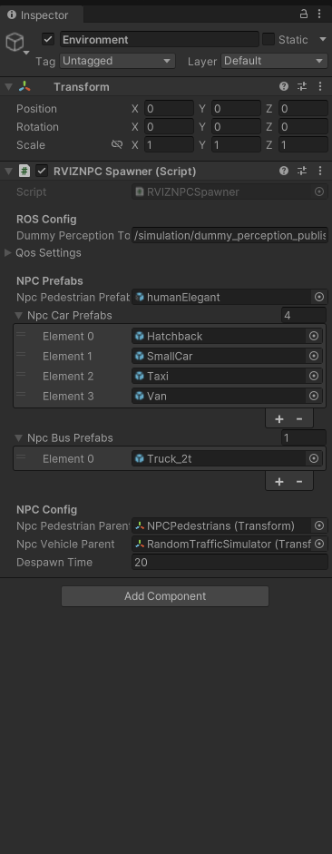
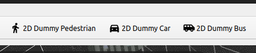
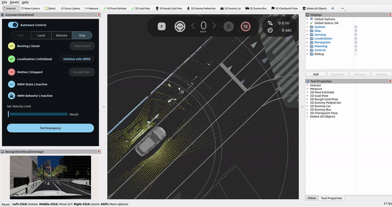
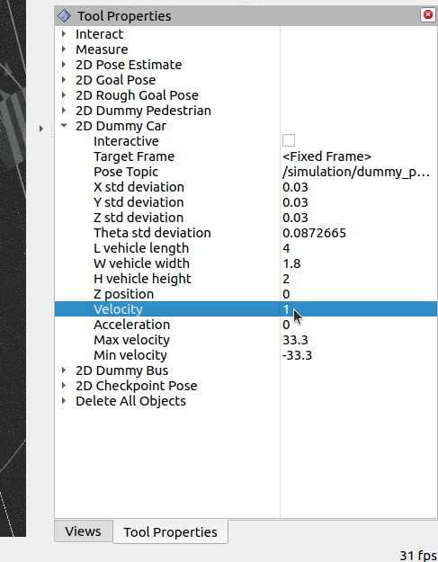

## Introduction
This feature allows you to spawn NPCs (pedestrians, cars, buses) in the Unity scene (AWSIM) from Autoware (RVIZ). It includes bulk deletion, vehicle velocity specification, and ensures NPC vehicles move straight, only colliding with the ground.

## Setup
You can change the configuration of the NPCs in the `RVIZNPCSpawner` component in AWSIM. It is attached to the Environment game object in the AutowareSimulation scene. You can also attach the `RVIZNPCSpawner` to any other game object and set all the required values in your custom scene.
- Attach the `RVIZNPCSpawner` component to one of the game objects in the scene. By default, it's attached to `Environment`.
- In AWSIM, you can add more cars (smaller vehicles) or buses (large vehicles) in the `Npc Car prefabs` / `Npc Bus prefabs` lists respectively.
- Then, select the `parent objects` under which the Pedestrians or Vehicles will be spawned.
- Finally, adjust the `Despawn time` to destroy the NPCs after a delay.
    

## Spawning NPCs from Autoware
- Open up Autoware.
- Click the `2D Dummy Car`,`2D Dummy Bus` or `2D Dummy Pedestrian` button in the toolbar.  
    
- Set the pose of the dummy object by clicking and dragging on the map.
    
- Set the velocity of the object in `Tool Properties` -> `2D Dummy Car/Pedestrian panel`.
    